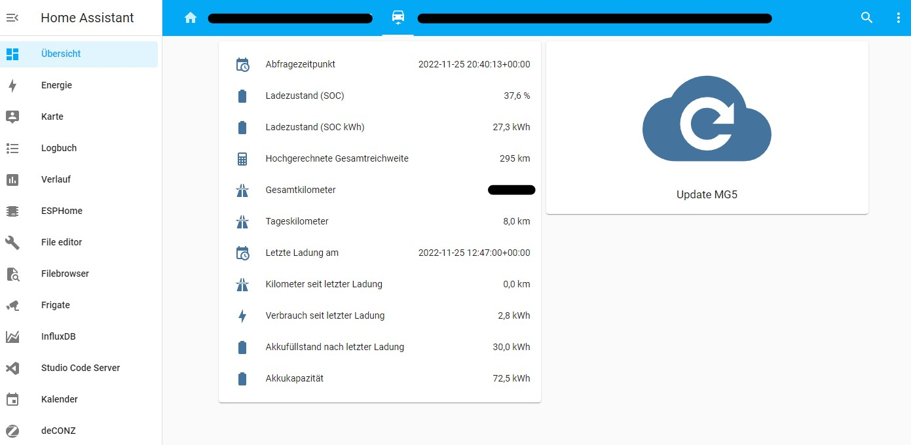

# MG iSmart/iSmart lite (SAIC API) API-Gateway for Home Assistant

This repository allows Home Assistant users to access the data of their MG5 electric (2022) car (https://www.mgmotor.de/model/mg5) via the iSmart/iSmart lite API (other models with iSmart might also work).

Main project can be found here (help needed):
[SAIC API Documentation](https://github.com/ReverseEngineeringDE/SAIC-API-Documentation)

Used .jar file based on: [saic-java-api-gateway](https://github.com/ReverseEngineeringDE/SAIC-API-Documentation/tree/main/saic-java-api-gateway)


**Warning: Don't access/refresh the API regularly.** It will drain your 12v car battery and you will be unable to start it! I implemented a 600s API refresh cooldown cache but be careful with your automations. This will be improved in future versions.

This is a work in progress (WIP). In the future this will be simplified by creating a native Home Assistant Add-on repository.

![Supports aarch64 Architecture][aarch64-shield]
![Supports amd64 Architecture][amd64-shield]
![Supports armhf Architecture][armhf-shield]
![Supports armv7 Architecture][armv7-shield]


## Overview





What is possible at the moment:

- Login & Read vehicle charging status endpoint (SOC, mileage...)
- Refresh data by an simple API-Call
- 600 seconds API-Response caching (to prevent 12v battery drain of the vehicle)

What is not possible at the moment:

- Send commands (pre-heat vehicle, set car-alarm...)
- Get extended vehicleData (GPS position, door status, tire pressure...)

How it is done:
Based on the work of [SAIC API Documentation](https://github.com/ReverseEngineeringDE/SAIC-API-Documentation) I wrote a simple API-wrapper to get access to the JSON output of the Java-Application (because I am unable to translate the code to Python - help needed!).

This .jar is then packaged into a Docker container (very inefficient - I know!) and will be run by Home Assistant. You then can access the API response in Home Assistant via the [RESTful integration](https://www.home-assistant.io/integrations/rest/).

### Architecture
1. Java-Application (this add-on):
- runs in a Docker container
- connects to the SAIC API
- provides the "getData" POST endpoint on port :42042

2. Home Assistant (you have to configure it, see below):
- Reads the endpoint with the RESTful integration
- parses the JSON output to sensors/entities

## Installation

**NOTE: In the future this will be simplified by creating a native Home Assistant Add-on repository**

1. Download the latest release or clone the repository
2. Extract the folder and put it in a subfolder in your Home Assistant Add-ons folder /addons/saic. This can be done via FTP access or the add-on "Filebrowser" (search for "Filebrowser" under Settings-->Add-ons-->Filebrowser).
3. In the Dockerfile uncomment the right CPU architecture (default Raspberry Pi --> arm64v8)
4. Open Settings --> Add-ons --> Button: Add-on Store --> Dot-Menu right top --> "Check for updates" to tell Home Assistant to search for the newly added Add-on
5. Install the add-on (takes up to 5-15 min on a Raspberry Pi) and start it
6. Docker-Container should be running - confirm that by going to the add-on page (SAIC Gateway) and click on the "Protocol" tab
7. Protocol tab should output "SAIC-API Gateway running! Access the API endpoints via http://localhost:42042/"

## Home Assistant Sensor/Entity

**Warning: Don't access/refresh the API regularly. It will drain your 12v car battery and you will be unable to start it! I implemented a 600s API refresh cooldown cache but be careful with your automations. This will be improved in future versions.**

**On every Home Assistant restart the RESTful service will call the API at least once!**

I solved the 12v drain issue with a very high scan_interval and a "update"-button in my Home Assistant interface (see screenshot and configuration below). In the future this will be improved.

### configurations.yaml

Add this to your Home Assistant configurations.yaml and enter you user and password in the params section (you can also use [Home Assistant Secrets](https://www.home-assistant.io/docs/configuration/secrets/)).

The full JSON output contains even more information than I needed. Take a look at the example JSON output to understand which "value_json." you can add to your configurations.yaml.

The high scan_interval will tell Home Assistant to not update this entity automatically (will drain the 12v battery). If you want to update the values with an automation or an interface button you have to call the "homeassistant.update_entity" service (see example below).

```
rest:
  - resource: http://localhost:42042/getData
    method: POST
    scan_interval: 360000
    timeout: 30
    params:
      user: "yourIsmartAccountEmailHere"
      password: "yourIsmartAccountPasswordHere"
    sensor:
      - name: "MG5_bmsPackSOCDsp"
        value_template: "{{(value_json.applicationData.bmsPackSOCDsp | float / 10 )}}"
        unit_of_measurement: "%"
      - name: "MG5_bmsEstdElecRng"
        value_template: "{{(value_json.applicationData.bmsEstdElecRng | int )}}"
        unit_of_measurement: "km"
      - name: "MG5_mileage"
        value_template: "{{(value_json.applicationData.chargeStatus.mileage | int / 10 )}}"
        unit_of_measurement: "km"
      - name: "MG5_eventCreationTime"
        value_template: "{{ as_datetime(value_json.body.eventCreationTime)}}"
      - name: "MG5_lastCharge_endTime"
        value_template: "{{ as_datetime(value_json.applicationData.chargeStatus.endTime)}}"
      - name: "MG5_mileageOfDay"
        value_template: "{{(value_json.applicationData.chargeStatus.mileageOfDay | int / 10 )}}"
        unit_of_measurement: "km"
      - name: "MG5_mileageSinceLastCharge"
        value_template: "{{(value_json.applicationData.chargeStatus.mileageSinceLastCharge | int / 10 )}}"
        unit_of_measurement: "km"
      - name: "MG5_realtimePower"
        value_template: "{{(value_json.applicationData.chargeStatus.realtimePower | float / 10 )}}"
        unit_of_measurement: "kWh"
      - name: "MG5_powerUsageSinceLastCharge"
        value_template: "{{(value_json.applicationData.chargeStatus.powerUsageSinceLastCharge | float / 10 )}}"
        unit_of_measurement: "kWh"
      - name: "MG5_totalBatteryCapacity"
        value_template: "{{(value_json.applicationData.chargeStatus.totalBatteryCapacity | float / 10 )}}"
        unit_of_measurement: "kWh"
      - name: "MG5_lastChargeEndingPower"
        value_template: "{{(value_json.applicationData.chargeStatus.lastChargeEndingPower | float / 10 )}}"
        unit_of_measurement: "kWh"
```

Restart Home Assistant if your created entities do not show up. Every API Gateway request is logged like the following (You can access it via the Add-on protocol):

```
SAIC-API Gateway running! Access the API endpoints via http://localhost:42042/ 
Accessed: /getData
Cooldown of 600 seconds is over and API request will be sent.
Sending login request...
Sending initial chargingStatusRequestMessage to wake the car...
Waiting for 6 seconds until the car woke up and responded to our request.
Waiting for 6 seconds until the car woke up and responded to our request.
We got a response.
```

#### Skip cooldown
If you want to skip the 600s cooldown/cache add "skipCooldown" as parameter to your POST request (not recommended).

```
    params:
      user: "yourIsmartAccountEmailHere"
      password: "yourIsmartAccountPasswordHere"
      skipCooldown: true
```

### Home Assistant example card (german translation)

Add a new element on your interface and click the "Show code-editor" button. Paste the following code to get the output of your RESTful integration configured above. The data will be displayed after your first successful call (which happens on a Home Assistant restart or with a homeassistant.update_entity service call).

```
type: entities
entities:
  - entity: sensor.mg5_eventcreationtime
    name: Abfragezeitpunkt
    icon: mdi:calendar-clock
  - entity: sensor.mg5_bmspacksocdsp
    icon: mdi:battery
    name: Ladezustand (SOC)
  - entity: sensor.mg5_realtimepower
    name: Ladezustand (SOC kWh)
    icon: mdi:battery
  - entity: sensor.mg5_bmsestdelecrng
    name: Hochgerechnete Gesamtreichweite
    icon: mdi:calculator
  - entity: sensor.mg5_mileage
    icon: mdi:highway
    name: Gesamtkilometer
  - entity: sensor.mg5_mileageofday
    name: Tageskilometer
    icon: mdi:highway
  - entity: sensor.mg5_lastcharge_endtime
    icon: mdi:calendar-clock
    name: Letzte Ladung am
  - entity: sensor.mg5_mileagesincelastcharge
    name: Kilometer seit letzter Ladung
    icon: mdi:highway
  - entity: sensor.mg5_powerusagesincelastcharge
    icon: mdi:lightning-bolt
    name: Verbrauch seit letzter Ladung
  - entity: sensor.mg5_lastchargeendingpower
    name: Akkufüllstand nach letzter Ladung
    icon: mdi:battery
  - entity: sensor.mg5_totalbatterycapacity
    name: Akkukapazität
    icon: mdi:battery
```

### JSON Result example response
If your login was successful the /getData endpoint will respond with following JSON:
[JSON example response](./docs/exampleResponse.json)


### Home Assistant refresh button
The refresh button will call the "homeassistant.update_entity" service. You just have to name one entity of the RESTful integration. This will start a POST request to the API Gateway container running under port 42042. The output of all values will be automatically parsed by Home Assistant. In my tests a refresh takes about 10s-16s.

```
show_name: true
show_icon: true
type: button
tap_action:
  action: call-service
  service: homeassistant.update_entity
  data: {}
  target:
    entity_id:
      - sensor.mg5_bmsestdelecrng
entity: ''
hold_action:
  action: none
name: Refresh MG5 Data
show_state: true
icon: mdi:cloud-refresh
```

### Home Assistant refresh automatization

If you want to update the data based on a trigger (e.g. your wallbox starts to charge and you only want to charge to a specific percentage) just use a Home Assistant Automation and select "Call Service" and "Update entity" as action. Then select **only one** entity which is listed under the RESTful integration.

## Security

This is a work in progress (WIP) and alpha version. **Please do not** open the Docker port :42042 to the public and only use it internal for Home Assistant.

### Built .jar by yourself
If you want to take a look through the code you can simply switch to [saic-java-api-gateway](https://github.com/ReverseEngineeringDE/SAIC-API-Documentation/tree/main/saic-java-api-gateway) and build the .jar by yourself. This newly built .jar can then replaced by the precompiled .jar.

## Run the .jar standalone
If you do not want to run the API Gateway on your Home Assistant instance or in a Docker container just run the .jar file like "java -jar .\ismart-api-1.0-SNAPSHOT-full.jar" (on windows). It will provide the API endpoint under the IP:42042.


## Issues & Feedback

Feel free to open issues to give us some feedback!

## License

Distributed under the MIT License. See [LICENSE.txt](/LICENSE.txt) for more information.

The usage of the MG iSmart System is covered by their [EULA](https://www.mgmotor.eu/ismart-eula).

Section 6 (Version: 10.2021) states:

> RESTRICTIONS: You are prohibited from renting, lending, public presentation, performance or broadcasting or any other kind of distribution of the Services. You will not, and you will not allow any person to, copy or modify the Services or any part thereof or to reverse engineer, decompile or disassemble the Services except as indispensable to install the App on your end device and to obtain the information necessary to establish the interoperability with an independently created computer programme. You may not use the Services in connection with any illegal, fraudulent, dishonest, unethical activity or behaviour and/or use the Services to store or transmit malicious code, interfere with the integrity or performance of the Services or attempt to gain unauthorised access to the Services and/or any systems or networks connected thereto. You shall keep your login credentials unavailable to others, except vis-a-vis your representatives which use the Services on behalf of you as Represented Party.

This project aims to *obtain the information necessary to establish the interoperability with an independently created computer programme* and is therefore allowed under the terms of the EULA.

<p align="right">(<a href="#readme-top">back to top</a>)</p>

[aarch64-shield]: https://img.shields.io/badge/aarch64-yes-green.svg
[amd64-shield]: https://img.shields.io/badge/amd64-yes-green.svg
[armhf-shield]: https://img.shields.io/badge/armhf-yes-green.svg
[armv7-shield]: https://img.shields.io/badge/armv7-yes-green.svg
[i386-shield]: https://img.shields.io/badge/i386-yes-green.svg
